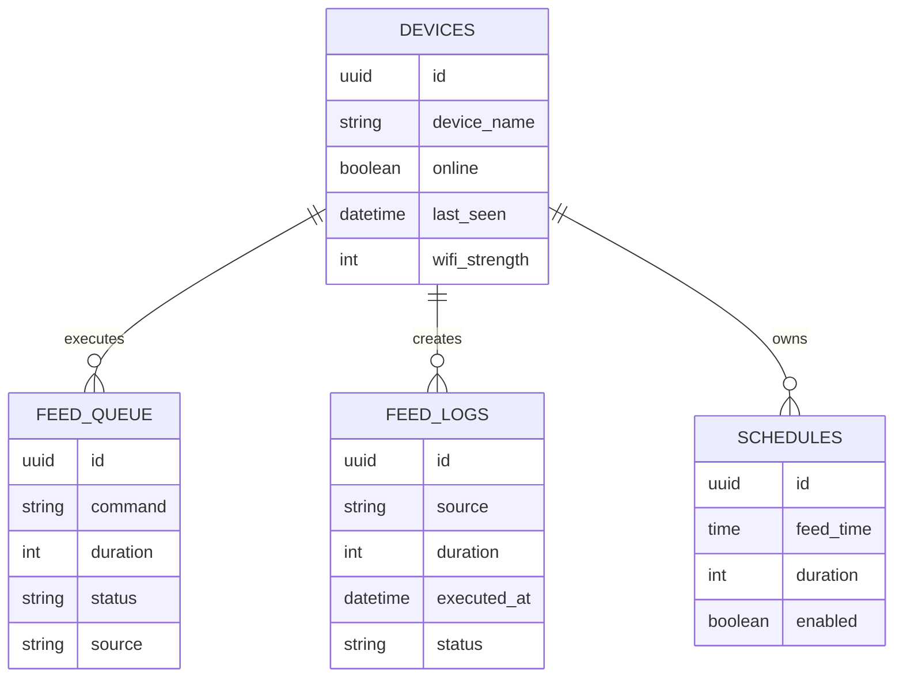

# Product Requirements Document (PRD)

## Smart Fish Feeder IoT (MVP)

**Version:** 1.0\
**Status:** Draft\
**Author:** Hanpi\
**Date:** 2026-07-02

------------------------------------------------------------------------

# 1. Product Overview

Smart Fish Feeder IoT adalah sistem pemberian pakan ikan otomatis
berbasis Internet of Things (IoT) yang memungkinkan pengguna mengontrol
proses pemberian pakan melalui website dari mana saja menggunakan
koneksi internet.

Stack teknologi:

-   Frontend: Next.js + TypeScript + Tailwind CSS
-   Backend: Supabase (Database, Auth, Realtime)
-   Deployment: Vercel
-   Hardware: ESP32 DevKit V1 + Servo SG90

------------------------------------------------------------------------

# 2. Background

Pemilik ikan sering mengalami kesulitan memberi pakan secara konsisten
ketika sedang bekerja, bepergian, atau lupa jadwal. Sistem ini dirancang
agar pemberian pakan dapat dilakukan secara manual maupun otomatis
melalui jadwal.

------------------------------------------------------------------------

# 3. Objectives

-   Memberikan pakan dari mana saja.
-   Menjadwalkan pemberian pakan.
-   Menampilkan status perangkat.
-   Menyimpan histori pemberian pakan.
-   Menjadi fondasi untuk pengembangan IoT selanjutnya.

------------------------------------------------------------------------

# 4. Scope MVP

## Included

-   Login
-   Dashboard
-   Manual Feeding
-   Schedule Feeding
-   Device Status
-   Feed History

## Excluded

-   MQTT
-   Kamera
-   Mobile App
-   Sensor Berat
-   Sensor Ultrasonik
-   Push Notification

------------------------------------------------------------------------

# 5. User Persona

-   Pemilik akuarium
-   Pemilik kolam ikan
-   Mahasiswa
-   Pengguna rumahan

------------------------------------------------------------------------

# 6. System Architecture

``` text
Internet
    │
Next.js (Vercel)
    │
Supabase
├── devices
├── feed_queue
├── schedules
└── feed_logs
    │
HTTP Polling
    │
ESP32 DevKit V1
    │
Servo SG90
```

------------------------------------------------------------------------

# 7. Database Design

## devices

  Field              Type        Description
  ------------------ ----------- ----------------
  id                 UUID        Primary Key
  device_name        Text        Nama perangkat
  online             Boolean     Status
  last_seen          Timestamp   Heartbeat
  wifi_strength      Integer     RSSI
  firmware_version   Text        Firmware

## feed_queue

  Field        Type
  ------------ -----------
  id           UUID
  command      Text
  duration     Integer
  source       Text
  status       Text
  created_at   Timestamp

Status:

-   pending
-   processing
-   done

## schedules

  Field       Type
  ----------- ---------
  id          UUID
  feed_time   Time
  duration    Integer
  enabled     Boolean

## feed_logs

  Field         Type
  ------------- -----------
  id            UUID
  source        Text
  duration      Integer
  executed_at   Timestamp
  status        Text

------------------------------------------------------------------------

# 8. User Flow

## Manual Feeding

``` text
User
 ↓
Klik Beri Pakan
 ↓
Input Durasi
 ↓
Insert feed_queue
 ↓
ESP32 Polling
 ↓
Servo Bergerak
 ↓
Update Status
 ↓
Insert feed_logs
```

## Schedule

``` text
User
 ↓
Tambah Jadwal
 ↓
Supabase
 ↓
ESP32 membaca schedules
 ↓
Servo Bergerak
 ↓
feed_logs
```

------------------------------------------------------------------------

# 9. Functional Requirements

## FR-01 Login

-   Login menggunakan Supabase Auth.

## FR-02 Dashboard

Menampilkan:

-   Device Status
-   Last Feed
-   Today's Feed Count
-   Schedule
-   History

## FR-03 Manual Feeding

-   Input durasi servo.
-   Kirim command.

Acceptance:

-   Command masuk feed_queue.
-   ESP32 menjalankan command.
-   History bertambah.

## FR-04 Schedule

-   Tambah
-   Edit
-   Hapus
-   Enable / Disable

## FR-05 History

Menyimpan:

-   Waktu
-   Jenis
-   Durasi
-   Status

## FR-06 Device Heartbeat

ESP32 update:

-   last_seen
-   RSSI
-   online

## FR-07 Queue

ESP32 hanya memproses status pending.

------------------------------------------------------------------------

# 10. Non Functional Requirements

-   Dashboard \< 3 detik.
-   Polling ESP32 2--5 detik.
-   Respon feeding \< 5 detik.
-   Auto reconnect WiFi.
-   Authentication wajib.

------------------------------------------------------------------------

# 11. Dashboard

-   Device Status
-   Last Feed
-   Feed Today
-   Manual Feeding Card
-   Schedule Card
-   History Table

------------------------------------------------------------------------

# 12. Firmware Flow

``` text
Boot
 ↓
Connect WiFi
 ↓
Sync NTP
 ↓
Polling feed_queue
 ↓
Ada pending?
 ├─ Tidak → ulangi
 └─ Ya
      ↓
 Servo bergerak
      ↓
 Update done
      ↓
 Insert feed_logs
```

------------------------------------------------------------------------

# 13. Project Structure

Project menggunakan pendekatan **Feature-Based Architecture** agar kode tetap terorganisir, mudah dipelihara, dan mudah dikembangkan ketika fitur baru ditambahkan. Seluruh source code frontend menggunakan Next.js App Router dengan TypeScript.

## 13.1 Repository Structure

```text
smart-fish-feeder/

├── docs/
│   ├── PRD.md
│   ├── ERD.md
│   ├── API.md
│   └── README.md
│
├── firmware/
│   └── esp32/
│       ├── src/
│       ├── include/
│       ├── platformio.ini (opsional)
│       └── README.md
│
├── hardware/
│   ├── wiring-diagram.png
│   ├── enclosure/
│   └── datasheet/
│
└── web/
    ├── public/
    ├── src/
    ├── package.json
    ├── next.config.ts
    ├── tsconfig.json
    └── README.md
```

---

## 13.2 Frontend Structure

```text
web/
│
├── public/
│
├── src/
│   │
│   ├── app/
│   │   ├── (auth)/
│   │   │   └── login/
│   │   │
│   │   ├── dashboard/
│   │   ├── history/
│   │   ├── schedules/
│   │   ├── settings/
│   │   ├── layout.tsx
│   │   └── page.tsx
│   │
│   ├── components/
│   │   ├── ui/
│   │   ├── layout/
│   │   └── shared/
│   │
│   ├── features/
│   │   ├── auth/
│   │   ├── dashboard/
│   │   ├── feeding/
│   │   ├── schedules/
│   │   ├── history/
│   │   └── device/
│   │
│   ├── hooks/
│   │
│   ├── lib/
│   │   └── supabase/
│   │
│   ├── services/
│   │
│   ├── types/
│   │
│   ├── constants/
│   │
│   ├── utils/
│   │
│   └── middleware.ts
│
├── package.json
├── tsconfig.json
└── next.config.ts
```

---

## 13.3 Folder Responsibilities

| Folder | Responsibility |
|----------|----------------|
| app | Routing menggunakan Next.js App Router. |
| components | Komponen UI yang dapat digunakan kembali (Button, Card, Dialog, Table, dll.). |
| features | Seluruh business logic dikelompokkan berdasarkan fitur aplikasi. |
| hooks | Custom React Hooks. |
| lib | Konfigurasi library eksternal seperti Supabase Client. |
| services | Seluruh komunikasi dengan database atau API. |
| types | TypeScript Interface dan Type Definition. |
| constants | Konstanta global aplikasi. |
| utils | Helper Function dan Utility. |
| public | Asset statis seperti logo dan ikon. |

---

## 13.4 Feature-Based Organization

Setiap fitur memiliki struktur folder sendiri agar mudah dipelihara.

```text
features/

├── feeding/
│   ├── components/
│   ├── hooks/
│   ├── services/
│   ├── types.ts
│   └── index.ts
│
├── schedules/
│   ├── components/
│   ├── hooks/
│   ├── services/
│   ├── types.ts
│   └── index.ts
│
├── history/
│   ├── components/
│   ├── services/
│   └── index.ts
│
├── dashboard/
│   ├── components/
│   ├── hooks/
│   └── index.ts
│
├── device/
│   ├── components/
│   ├── hooks/
│   ├── services/
│   └── index.ts
│
└── auth/
    ├── components/
    ├── hooks/
    ├── services/
    └── index.ts
```

---

## 13.5 Design Principles

Struktur project mengikuti beberapa prinsip berikut:

- Feature-Based Architecture untuk memudahkan pengembangan fitur.
- Separation of Concerns antara UI, business logic, dan data access.
- Reusable Components untuk mengurangi duplikasi kode.
- Scalable Structure sehingga mudah menambahkan fitur baru tanpa mengubah struktur yang sudah ada.
- Modular Code Organization agar setiap fitur dapat dikembangkan secara independen.

---

## 13.6 Future Scalability

Apabila pada versi berikutnya ditambahkan fitur baru seperti MQTT, sensor pakan, atau notifikasi, maka cukup menambahkan folder baru pada direktori `features`.

Contoh:

```text
features/

├── mqtt/
├── notification/
├── sensor/
├── analytics/
└── camera/
```

Dengan pendekatan ini, struktur project tetap konsisten meskipun jumlah fitur bertambah.

------------------------------------------------------------------------

# 14. Roadmap

## MVP V1

-   Remote Feeding
-   Dashboard
-   History

## MVP V2

-   Schedule

## MVP V3

-   Device Monitoring

------------------------------------------------------------------------

# 15. Success Metrics

  Metric         Target
  -------------- --------
  ESP32 Online   100%
  Manual Feed    100%
  Schedule       100%
  History        100%
  Dashboard      \<3 s

------------------------------------------------------------------------

# 16. Future Enhancement

-   MQTT
-   HX711 Load Cell
-   Ultrasonic
-   WhatsApp Notification
-   OTA Update
-   Multi Device
-   Mobile App
-   Water Temperature
-   pH Monitoring

------------------------------------------------------------------------

# 17. Mermaid ER Diagram


